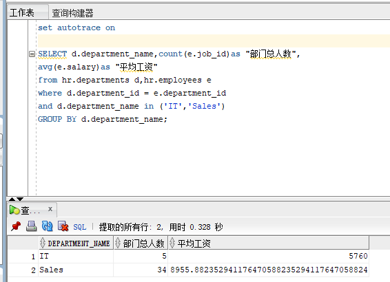
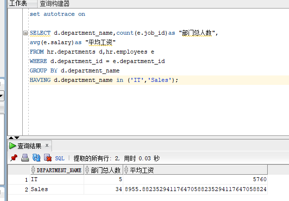
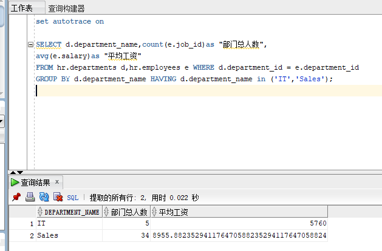
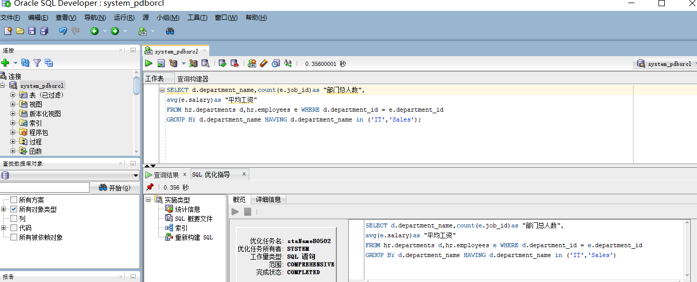

# Oracle数据库第一次实验

姓名：陈小屿 学号：201810414207 班级：18级软件工程2班

## 实验目的

### 分析SQL执行计划，执行SQL语句的优化指导。理解分析SQL语句的执行计划的重要作用。

## 实验内容

### 对Oracle12c中的HR人力资源管理系统中的表进行查询与分析。

### 首先运行和分析教材中的样例：本训练任务目的是查询两个部门('IT'和'Sales')的部门总人数和平均工资，以下两个查询的结果是一样的。但效率不相同。

### 设计自己的查询语句，并作相应的分析，查询语句不能太简单。

## 教材中的查询语句

### 查询1

set autotrace on

SELECT d.department_name,count(e.job_id)as "部门总人数",
avg(e.salary)as "平均工资"
from hr.departments d,hr.employees e
where d.department_id = e.department_id
and d.department_name in ('IT','Sales')
GROUP BY d.department_name;

### 查询2

set autotrace on

SELECT d.department_name,count(e.job_id)as "部门总人数",
avg(e.salary)as "平均工资"
FROM hr.departments d,hr.employees e
WHERE d.department_id = e.department_id
GROUP BY d.department_name
HAVING d.department_name in ('IT','Sales');

## 我设计的查询语句

### 查询

SELECT d.department_name,count(e.job_id)as "部门总人数",
avg(e.salary)as "平均工资" 
FROM hr.departments d,hr.employees e WHERE d.department_id = e.department_id
GROUP BY d.department_name HAVING d.department_name in ('IT','Sales');

### 分析

通过select语句确定要查询的字段，用from where 语句确定要查询的表，group by 确定要查询的部门

## 优化建议

