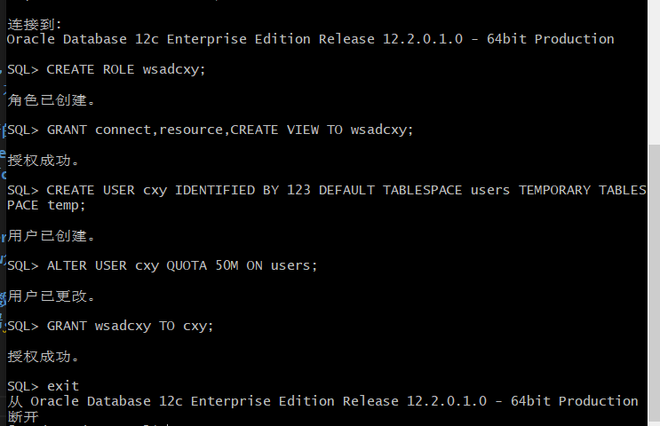
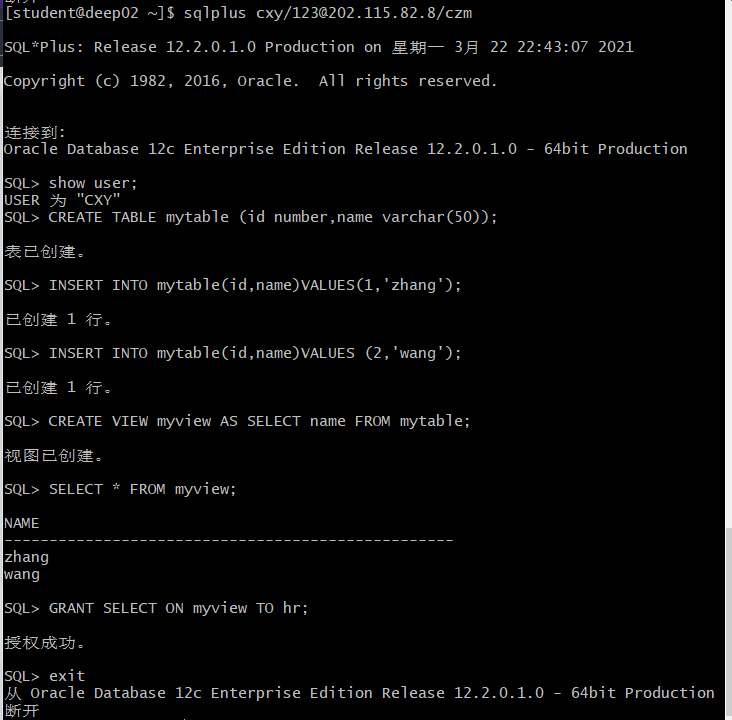
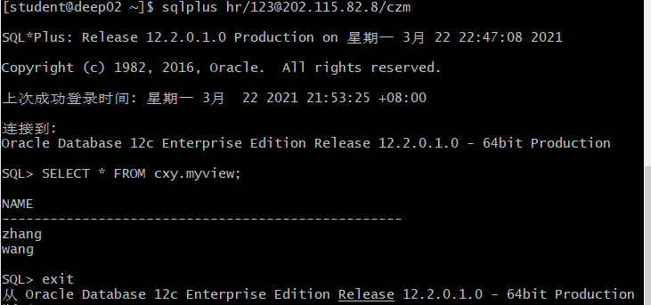
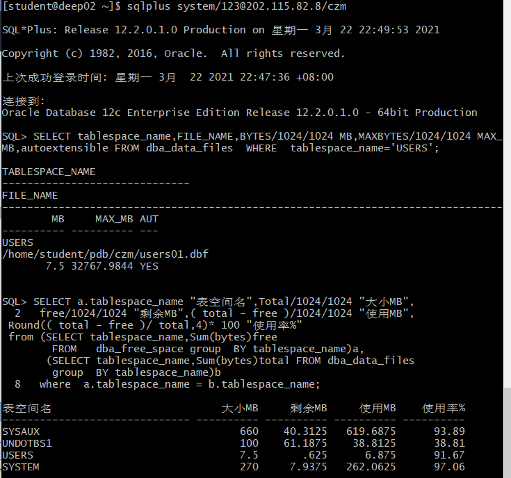

# Oracle数据库第二次实验

姓名：陈小屿 学号：201810414207 班级：18级软件工程2班

## 实验目的

### 掌握用户管理、角色管理、权根维护与分配的能力，掌握用户之间共享对象的操作技能。

## 实验内容

### Oracle有一个开发者角色resource，可以创建表、过程、触发器等对象，但是不能创建视图。本训练要求：

### 在pdborcl插接式数据中创建一个新的本地角色con_res_view，该角色包含connect和resource角色，同时也包含CREATE VIEW权限，这样任何拥有con_res_view的用户就同时拥有这三种权限。

### 创建角色之后，再创建用户new_user，给用户分配表空间，设置限额为50M，授予con_res_view角色。

### 最后测试：用新用户new_user连接数据库、创建表，插入数据，创建视图，查询表和视图的数据。

## 实验步骤

### 步骤1

### 步骤2

### 步骤3

### 步骤4

