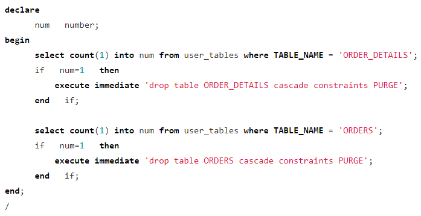
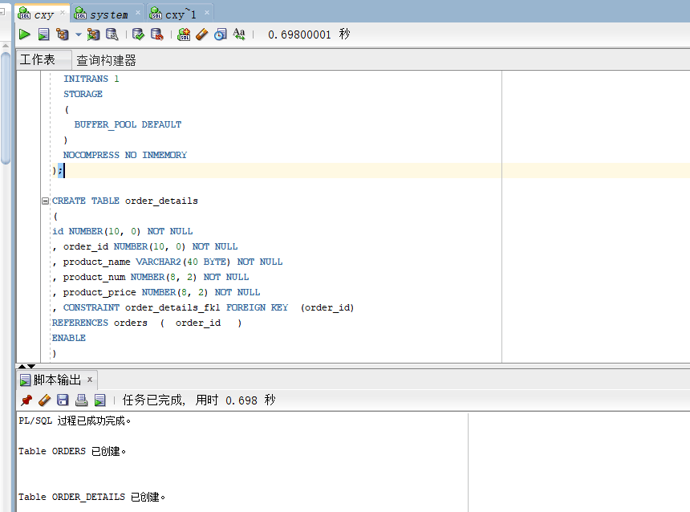
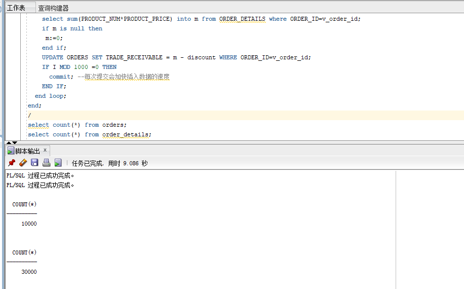
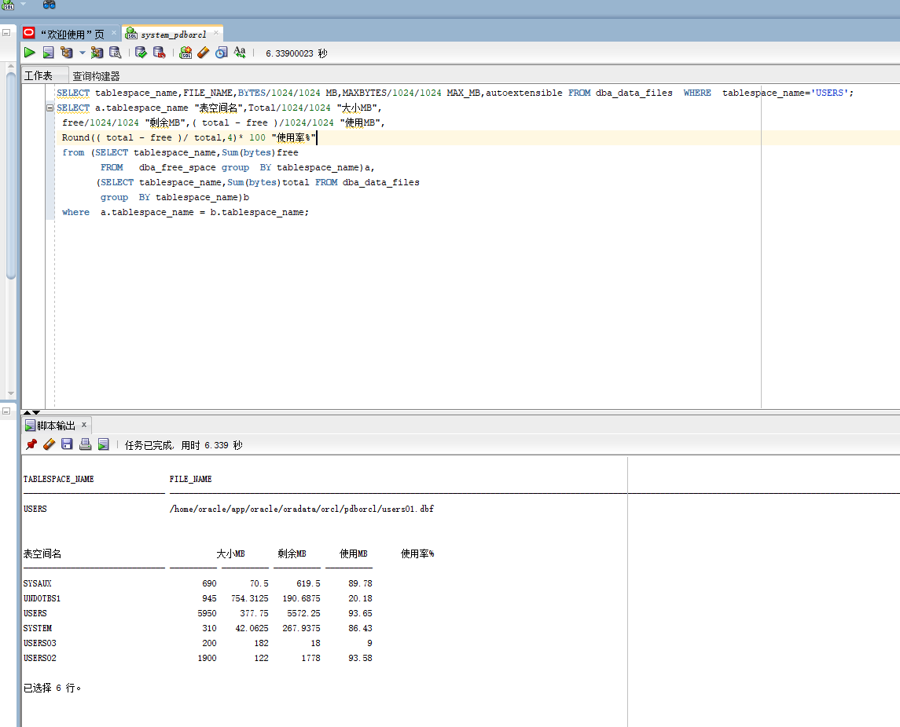
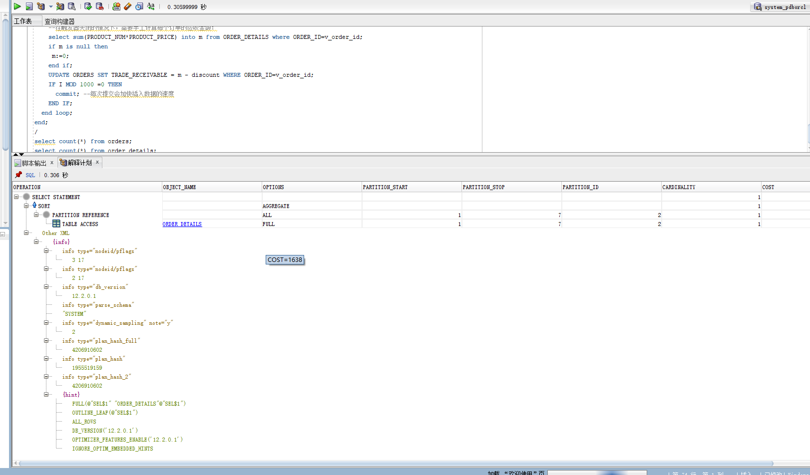

# Oracle数据库第三次实验

姓名：陈小屿 学号：201810414207 班级：18级软件工程2班

## 实验目的

### 掌握分区表的创建方法，掌握各种分区方式的使用场景。

## 实验内容

### 本实验使用3个表空间：USERS,USERS02,USERS03。在表空间中创建两张表：订单表(orders)与订单详表(order_details)。

### 使用你自己的账号创建本实验的表，表创建在上述3个分区，自定义分区策略。

### 你需要使用system用户给你自己的账号分配上述分区的使用权限。你需要使用system用户给你的用户分配可以查询执行计划的权限。

### 表创建成功后，插入数据，数据能并平均分布到各个分区。每个表的数据都应该大于1万行，对表进行联合查询。

### 写出插入数据的语句和查询数据的语句，并分析语句的执行计划。

### 进行分区与不分区的对比实验。

## 实验步骤

### 检查是否有相同命名的表，若有，则删除，若无，继续下面的命令

### 创建主表orders(订单表)和从表order_details(订单详表)

### 插入数据

### 查看数据库的使用情况

### 插入数据和查询数据的执行计划

## 实验参考

### Oracle地址：202.115.82.8 用户名：system,hr,你的用户名 ， 密码123， 数据库名称：pdborcl/或者你的数据库，端口号：1521

### ssh oracle@202.115.82.8

### test3.sql

### SQL-DEVELOPER修改用户的操作界面： 

### sqldeveloper授权对象的操作界面： 