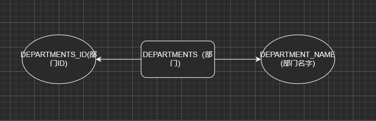
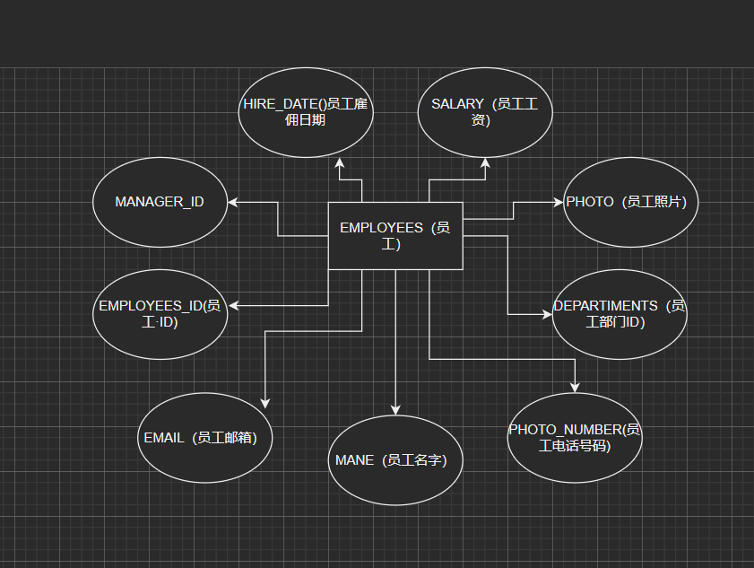
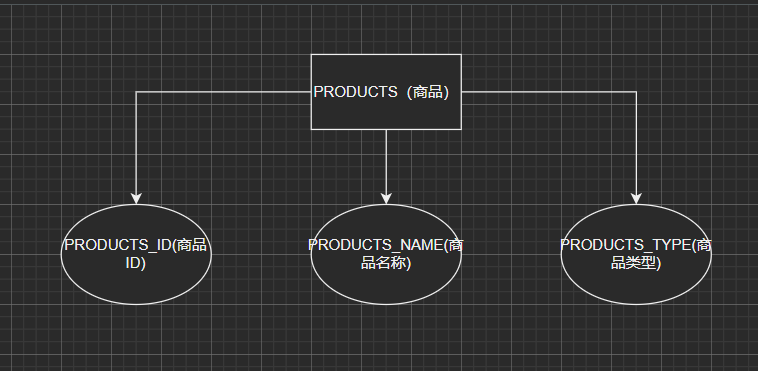
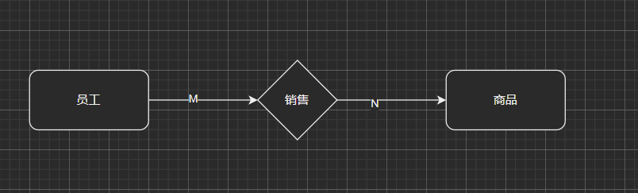
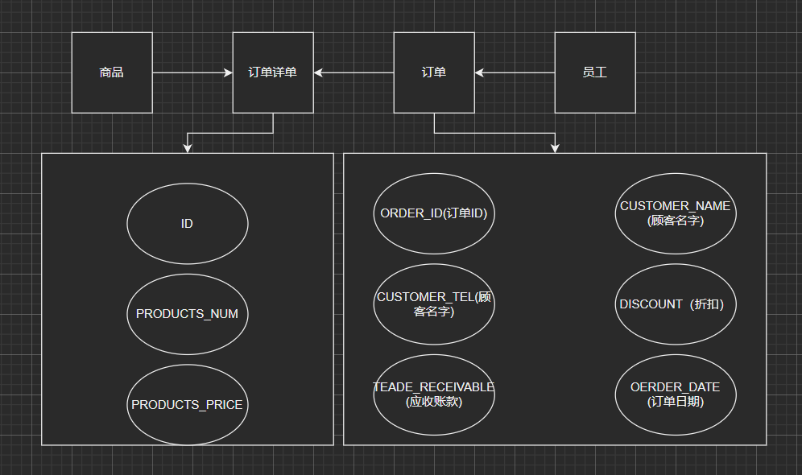

# 姓名: 陈小屿  学号: 201810414207  班级: 软工二班

## 实验6: 基于Oracle的某项目数据库设计

## 实验要求

·自行设计一个信息系统的数据库项目，自拟 某项目 名称。

·设计项目涉及的表及表空间使用方案。至少5张表和5万条数据，两个表空间。

·设计权限及用户分配方案。至少两类角色，两个用户。

·在数据库中建立一个程序包，在包中用PL/SQL语言设计一些存储过程和函数，

·实现比较复杂的业务逻辑，用模拟数据进行执行计划分析。

·设计自动备份方案或则手工备份方案。

·设计容灾方案。使用两台主机，通过DataGuard实现数据库整体的异地备份(可选)。

## 实验选题: 网上商店管理系统

## 实验内容

### 1 自行设计一个信息系统的数据库项目，自拟 某项目 名称

某网上商店， 该超市能接受网上订单进行产品的销售。实验部分信息：员工表，部门表，订单表，订单详单表，商品表。

#### 1.1 E-R图设计

根据场景分析一共有3个实体：部门、员工、商品

部门

员工

商品

联系模型：订单表、订单详表

1

2

### 2 设计项目涉及的表及表空间使用方案。至少5张表和5万条数据，两个表空间

#### 2.1 设计数据表

DEPARTMENTS(部门)
|  字段名   | 数据类型   |  可以为空   |  注释                |
|  ----     |   ----    |     ----    | ----                |
| DEPARTMENT_ID  | NUMBER(6,0) | NO  | 部门ID,主键          |
| DEPARTMENT_NAME| VARCHAR2(40 BYTE) | NO  | 部门名称，非空 |

EMPLOYEES(员工)
|  字段名   | 数据类型   |  可以为空   |  注释                |
|  ----     |   ----    |     ----    | ----                |
| EMPLOYEE_ID  | NUMBER(6,0) | NO  | 员工ID,主键          |
|  MANE| VARCHAR2(40 BYTE) | NO  | 员工名字,不能为空，创建不唯一B树索引 |
| EMAIL | VARCHAR2(40 BYTE)  | YES  | 员工邮箱         |
| PHONE_NUMBER| VARCHAR2(40 BYTE) | YES  | 员工电话号码 |
| HIRE_DATE | DATE | NO  | 员工雇用日期     |
| SALARY| NUMBER(8,2) | YES  | 员工工资,>0 |
| DEPARTMENT_ID  | NUMBER(6,0) | YES  | 员工的部门ID,是DEPARTMENTS的外键          |
| PHOTO| BLOB | YES  | 员工照片 |
| MANAGER_ID| NUMBER(6,0) | YES  | 经理ID,员工表EMPLOYEES_ID 的外键 不能与EMPLOYEES_ID相等|

PRODUCTS(商品)
|  字段名   | 数据类型   |  可以为空   |  注释       |
|  ----     |   ----    |     ----    | ----       |
| PRODUCT_ID  | NUMBER(6,0) | NO  | 商品ID,主键    |
| PRODUCT_NAME| VARCHAR2(40 BYTE) | NO  | 商品名称 |
| PRODUCT_TYPE| VARCHAR2(40 BYTE) | NO  | 商品类型，只能取值：'食品', '饮料', '生活用品' |

ORDERS(订单)
|  字段名   | 数据类型   |  可以为空   |  注释       |
|  ----     |   ----    |     ----    | ----       |
| ORDER_ID  | NUMBER(10,0) | NO  | 订单ID,主键,值来自于SEQ_ORDER_ID|
| CUSTOMER_NAME| VARCHAR2(40 BYTE) | NO  | 客户名称，B数索引 |
| CUSTOMER_TEL| VARCHAR2(40 BYTE) | NO  | 客户电话 |
| ORDER_DATE  | DATE | NO  | 订单日期，应该采用分区储存方式 |
| EMPLOYEE_ID| NUMBER(6,0 | NO  | 订单经手人，员工表EMPLOYEES的外键|
| DISCOUNT| Number(8,2) | YES  | 订单整体优惠金额，默认为0 |
| TRADE_RECEIVABLE  | Number(8,2)  | YES  | 订单应收货款，默认为0    |

ORDERS_DETAILS(订单详单)
|  字段名   | 数据类型   |  可以为空   |  注释       |
|  ----     |   ----    |     ----    | ----       |
| ID  | NUMBER(10,0) | NO  | 订单详单ID,主键,值来自于SEQ_ORDER_ID|
| ORDER_ID| NUMBER(10,0) | NO  | 订单号，订单表ORDERS的外键 |
| PRODUCT_ID| VARCHAR2(40 BYTE) | NO  | 商品ID,商品表PRODUCTS的外键 |
| PRODUCT_NUM  | NUMBER(8,2) | NO  | 商品销售数量，>0|
| PRODUCT_PRICE| NUMBER(8,2) | NO  | 商品销售价格|

ORDERS_ID_TEMP(订单ID临时表)
|  字段名   | 数据类型   |  可以为空   |  注释       |
|  ----     |   ----    |     ----    | ----       |
| ORDER_ID  | NUMBER(10,0) | NO  | 主键|

#### 2.2 创建表空间 pdbtest_users02_1.dbf 与 pdbtest_users02_2.dbf

    CREATE TABLESPACE Users02
    DATAFILE
    '/home/oracle/app/oracle/oradata/orcl/pdborcl/pdbtest_users02_1.dbf'
    SIZE 100M AUTOEXTEND ON NEXT 256M MAXSIZE UNLIMITED,
    '/home/oracle/app/oracle/oradata/orcl/pdborcl/pdbtest_users02_2.dbf'
    SIZE 100M AUTOEXTEND ON NEXT 256M MAXSIZE UNLIMITED
    EXTENT MANAGEMENT LOCAL SEGMENT SPACE MANAGEMENT AUTO;

#### 2.3 创建用户YUKINO与DEEPSNOW

分配表空间pdbtest_users02_1.dbf 与 pdbtest_users02_2.dbf的使用配额，再分配角色CONNECT和RESOURCE,便于用户可以连接到数据库来创建资源，最后再分配一个系统权限："CREATE VIEW"，便于用户可以创建视图

    --创建用户YUKINO
    CREATE USER YUKINO IDENTIFIED BY 123
    DEFAULT TABLESPACE "USERS"
    TEMPORARY TABLESPACE "TEMP";
    
    -- QUOTAS
    ALTER USER YUKINO QUOTA UNLIMITED ON USERS;
    ALTER USER YUKINO QUOTA UNLIMITED ON USERS02;
    
    -- ROLES
    GRANT "CONNECT" TO YUKINO WITH ADMIN OPTION;
    GRANT "RESOURCE" TO YUKINO WITH ADMIN OPTION;
    ALTER USER YUKINO DEFAULT ROLE "CONNECT","RESOURCE";
    
    -- SYSTEM PRIVILEGES
    GRANT CREATE VIEW TO YUKINO WITH ADMIN OPTION;
    
    --创建用户DEEPSNOW
    CREATE USER DEEPSNOW IDENTIFIED BY 123
    DEFAULT TABLESPACE "USERS"
    TEMPORARY TABLESPACE "TEMP";
    
    -- QUOTAS
    ALTER USER DEEPSNOW QUOTA UNLIMITED ON USERS;
    ALTER USER DEEPSNOW QUOTA UNLIMITED ON USERS02;
    
    -- ROLES
    GRANT "CONNECT" TO DEEPSNOW WITH ADMIN OPTION;
    GRANT "RESOURCE" TO DEEPSNOW WITH ADMIN OPTION;
    ALTER USER DEEPSNOW DEFAULT ROLE "CONNECT","RESOURCE";
    
    -- SYSTEM PRIVILEGES
    GRANT CREATE VIEW TO DEEPSNOW WITH ADMIN OPTION;

#### 2.3 创建表

创建DEPARTMENTS表

    CREATE TABLE DEPARTMENTS
    (
    DEPARTMENT_ID NUMBER(6, 0) NOT NULL
    , DEPARTMENT_NAME VARCHAR2(40 BYTE) NOT NULL
    , CONSTRAINT DEPARTMENTS_PK PRIMARY KEY
    (
        DEPARTMENT_ID
    )
    USING INDEX
    (
        CREATE UNIQUE INDEX DEPARTMENTS_PK ON DEPARTMENTS (DEPARTMENT_ID ASC)
        NOLOGGING
        TABLESPACE USERS
        PCTFREE 10
        INITRANS 2
        STORAGE
        (
            INITIAL 65536
            NEXT 1048576
            MINEXTENTS 1
            MAXEXTENTS UNLIMITED
            BUFFER_POOL DEFAULT
        )
        NOPARALLEL
    )
    ENABLE
    )
    NOLOGGING
    TABLESPACE USERS
    PCTFREE 10
    INITRANS 1
    STORAGE
    (
    INITIAL 65536
    NEXT 1048576
    MINEXTENTS 1
    MAXEXTENTS UNLIMITED
    BUFFER_POOL DEFAULT
    )
    NOCOMPRESS NO INMEMORY NOPARALLEL;

创建EMPLOYEES表

    CREATE TABLE EMPLOYEES
    (
    EMPLOYEE_ID NUMBER(6, 0) NOT NULL
    , NAME VARCHAR2(40 BYTE) NOT NULL
    , EMAIL VARCHAR2(40 BYTE)
    , PHONE_NUMBER VARCHAR2(40 BYTE)
    , HIRE_DATE DATE NOT NULL
    , SALARY NUMBER(8, 2)
    , MANAGER_ID NUMBER(6, 0)
    , DEPARTMENT_ID NUMBER(6, 0)
    , PHOTO BLOB
    , CONSTRAINT EMPLOYEES_PK PRIMARY KEY
    (
        EMPLOYEE_ID
    )
    USING INDEX
    (
        CREATE UNIQUE INDEX EMPLOYEES_PK ON EMPLOYEES (EMPLOYEE_ID ASC)
        NOLOGGING
        TABLESPACE USERS
        PCTFREE 10
        INITRANS 2
        STORAGE
        (
            INITIAL 65536
            NEXT 1048576
            MINEXTENTS 1
            MAXEXTENTS UNLIMITED
            BUFFER_POOL DEFAULT
        )
        NOPARALLEL
    )
    ENABLE
    )
    NOLOGGING
    TABLESPACE USERS
    PCTFREE 10
    INITRANS 1
    STORAGE
    (
    INITIAL 65536
    NEXT 1048576
    MINEXTENTS 1
    MAXEXTENTS UNLIMITED
    BUFFER_POOL DEFAULT
    )
    NOCOMPRESS
    NO INMEMORY
    NOPARALLEL
    LOB (PHOTO) STORE AS SYS_LOB0000092017C00009$$
    (
    ENABLE STORAGE IN ROW
    CHUNK 8192
    NOCACHE
    NOLOGGING
    TABLESPACE USERS
    STORAGE
    (
        INITIAL 106496
        NEXT 1048576
        MINEXTENTS 1
        MAXEXTENTS UNLIMITED
        BUFFER_POOL DEFAULT
    )
    );
    
    CREATE INDEX EMPLOYEES_INDEX1_NAME ON EMPLOYEES (NAME ASC)
    NOLOGGING
    TABLESPACE USERS
    PCTFREE 10
    INITRANS 2
    STORAGE
    (
    INITIAL 65536
    NEXT 1048576
    MINEXTENTS 1
    MAXEXTENTS UNLIMITED
    BUFFER_POOL DEFAULT
    )
    NOPARALLEL;
    
    ALTER TABLE EMPLOYEES
    ADD CONSTRAINT EMPLOYEES_FK1 FOREIGN KEY
    (
    DEPARTMENT_ID
    )
    REFERENCES DEPARTMENTS
    (
    DEPARTMENT_ID
    )
    ENABLE;
    
    ALTER TABLE EMPLOYEES
    ADD CONSTRAINT EMPLOYEES_FK2 FOREIGN KEY
    (
    MANAGER_ID
    )
    REFERENCES EMPLOYEES
    (
    EMPLOYEE_ID
    )
    ON DELETE SET NULL ENABLE;
    
    ALTER TABLE EMPLOYEES
    ADD CONSTRAINT EMPLOYEES_CHK1 CHECK
    (SALARY>0)
    ENABLE;
    
    ALTER TABLE EMPLOYEES
    ADD CONSTRAINT EMPLOYEES_CHK2 CHECK
    (EMPLOYEE_ID<>MANAGER_ID)
    ENABLE;
    
    ALTER TABLE EMPLOYEES
    ADD CONSTRAINT EMPLOYEES_EMPLOYEE_MANAGER_ID CHECK
    (MANAGER_ID<>EMPLOYEE_ID)
    ENABLE;
    
    ALTER TABLE EMPLOYEES
    ADD CONSTRAINT EMPLOYEES_SALARY CHECK
    (SALARY>0)
    ENABLE;

创建PRODUCTS表

    CREATE TABLE PRODUCTS
    (
    PRODUCT_NAME VARCHAR2(40 BYTE) NOT NULL
    , PRODUCT_TYPE VARCHAR2(40 BYTE) NOT NULL
    , CONSTRAINT PRODUCTS_PK PRIMARY KEY
    (
        PRODUCT_NAME
    )
    ENABLE
    )
    LOGGING
    TABLESPACE "USERS"
    PCTFREE 10
    INITRANS 1
    STORAGE
    (
    INITIAL 65536
    NEXT 1048576
    MINEXTENTS 1
    MAXEXTENTS 2147483645
    BUFFER_POOL DEFAULT
    );
    
    ALTER TABLE PRODUCTS
    ADD CONSTRAINT PRODUCTS_CHK1 CHECK
    (PRODUCT_TYPE IN ('食品', '饮料', '生活用品'))
    ENABLE;

创建ORDERS表及相关表, 表空间：分区表：USERS,USERS02

    CREATE GLOBAL TEMPORARY TABLE "ORDER_ID_TEMP"
    ("ORDER_ID" NUMBER(10,0) NOT NULL ENABLE,
        CONSTRAINT "ORDER_ID_TEMP_PK" PRIMARY KEY ("ORDER_ID") ENABLE
    ) ON COMMIT DELETE ROWS ;
    
    COMMENT ON TABLE "ORDER_ID_TEMP"  IS '用于触发器存储临时ORDER_ID';
    
    CREATE TABLE ORDERS
    (
    ORDER_ID NUMBER(10, 0) NOT NULL
    , CUSTOMER_NAME VARCHAR2(40 BYTE) NOT NULL
    , CUSTOMER_TEL VARCHAR2(40 BYTE) NOT NULL
    , ORDER_DATE DATE NOT NULL
    , EMPLOYEE_ID NUMBER(6, 0) NOT NULL
    , DISCOUNT NUMBER(8, 2) DEFAULT 0
    , TRADE_RECEIVABLE NUMBER(8, 2) DEFAULT 0
    )
    TABLESPACE USERS
    PCTFREE 10
    INITRANS 1
    STORAGE
    (
    BUFFER_POOL DEFAULT
    )
    NOCOMPRESS
    NOPARALLEL
    PARTITION BY RANGE (ORDER_DATE)
    (
    PARTITION PARTITION_BEFORE_2016 VALUES LESS THAN (TO_DATE(' 2016-01-01 00:00:00', 'SYYYY-MM-DD HH24:MI:SS', 'NLS_CALENDAR=GREGORIAN'))
    NOLOGGING
    TABLESPACE USERS
    PCTFREE 10
    INITRANS 1
    STORAGE
    (
        INITIAL 8388608
        NEXT 1048576
        MINEXTENTS 1
        MAXEXTENTS UNLIMITED
        BUFFER_POOL DEFAULT
    )
    NOCOMPRESS NO INMEMORY
    , PARTITION PARTITION_BEFORE_2017 VALUES LESS THAN (TO_DATE(' 2017-01-01 00:00:00', 'SYYYY-MM-DD HH24:MI:SS', 'NLS_CALENDAR=GREGORIAN'))
    NOLOGGING
    TABLESPACE USERS02
    PCTFREE 10
    INITRANS 1
    STORAGE
    (
        INITIAL 8388608
        NEXT 1048576
        MINEXTENTS 1
        MAXEXTENTS UNLIMITED
        BUFFER_POOL DEFAULT
    )
    NOCOMPRESS NO INMEMORY
    );

--创建本地分区索引ORDERS_INDEX_DATE：

    CREATE INDEX ORDERS_INDEX_DATE ON ORDERS (ORDER_DATE ASC)
    LOCAL
    (
    PARTITION PARTITION_BEFORE_2016
        TABLESPACE USERS
        PCTFREE 10
        INITRANS 2
        STORAGE
        (
        INITIAL 8388608
        NEXT 1048576
        MINEXTENTS 1
        MAXEXTENTS UNLIMITED
        BUFFER_POOL DEFAULT
        )
        NOCOMPRESS
    , PARTITION PARTITION_BEFORE_2017
        TABLESPACE USERS02
        PCTFREE 10
        INITRANS 2
        STORAGE
        (
        INITIAL 8388608
        NEXT 1048576
        MINEXTENTS 1
        MAXEXTENTS UNLIMITED
        BUFFER_POOL DEFAULT
        )
        NOCOMPRESS
    )
    STORAGE
    (
    BUFFER_POOL DEFAULT
    )
    NOPARALLEL;
    
    CREATE INDEX ORDERS_INDEX_CUSTOMER_NAME ON ORDERS (CUSTOMER_NAME ASC)
    NOLOGGING
    TABLESPACE USERS
    PCTFREE 10
    INITRANS 2
    STORAGE
    (
    INITIAL 65536
    NEXT 1048576
    MINEXTENTS 1
    MAXEXTENTS UNLIMITED
    BUFFER_POOL DEFAULT
    )
    NOPARALLEL;
    
    CREATE UNIQUE INDEX ORDERS_PK ON ORDERS (ORDER_ID ASC)
    GLOBAL PARTITION BY HASH (ORDER_ID)
    (
    PARTITION INDEX_PARTITION1 TABLESPACE USERS
        NOCOMPRESS
    , PARTITION INDEX_PARTITION2 TABLESPACE USERS02
        NOCOMPRESS
    )
    NOLOGGING
    TABLESPACE USERS
    PCTFREE 10
    INITRANS 2
    STORAGE
    (
    INITIAL 65536
    NEXT 1048576
    MINEXTENTS 1
    MAXEXTENTS UNLIMITED
    BUFFER_POOL DEFAULT
    )
    NOPARALLEL;
    
    ALTER TABLE ORDERS
    ADD CONSTRAINT ORDERS_PK PRIMARY KEY
    (
    ORDER_ID
    )
    USING INDEX ORDERS_PK
    ENABLE;
    
    ALTER TABLE ORDERS
    ADD CONSTRAINT ORDERS_FK1 FOREIGN KEY
    (
    EMPLOYEE_ID
    )
    REFERENCES EMPLOYEES
    (
    EMPLOYEE_ID
    )
    ENABLE;
    
    CREATE TABLE ORDER_DETAILS
    (
    ID NUMBER(10, 0) NOT NULL
    , ORDER_ID NUMBER(10, 0) NOT NULL
    , PRODUCT_NAME VARCHAR2(40 BYTE) NOT NULL
    , PRODUCT_NUM NUMBER(8, 2) NOT NULL
    , PRODUCT_PRICE NUMBER(8, 2) NOT NULL
    , CONSTRAINT ORDER_DETAILS_FK1 FOREIGN KEY
    (
    ORDER_ID
    )
    REFERENCES ORDERS
    (
    ORDER_ID
    )
    ENABLE
    )
    TABLESPACE USERS
    PCTFREE 10
    INITRANS 1
    STORAGE
    (
    BUFFER_POOL DEFAULT
    )
    NOCOMPRESS
    NOPARALLEL
    PARTITION BY REFERENCE (ORDER_DETAILS_FK1)
    (
    PARTITION PARTITION_BEFORE_2016
    NOLOGGING
    TABLESPACE USERS 
    --必须指定表空间，否则会将分区存储在用户的默认表空间中
    PCTFREE 10
    INITRANS 1
    STORAGE
    (
        INITIAL 8388608
        NEXT 1048576
        MINEXTENTS 1
        MAXEXTENTS UNLIMITED
        BUFFER_POOL DEFAULT
    )
    NOCOMPRESS NO INMEMORY,
    PARTITION PARTITION_BEFORE_2017
    NOLOGGING
    TABLESPACE USERS02
    PCTFREE 10
    INITRANS 1
    STORAGE
    (
        INITIAL 8388608
        NEXT 1048576
        MINEXTENTS 1
        MAXEXTENTS UNLIMITED
        BUFFER_POOL DEFAULT
    )
    NOCOMPRESS NO INMEMORY
    )
    ;
    
    CREATE UNIQUE INDEX ORDER_DETAILS_PK ON ORDER_DETAILS (ID ASC)
    NOLOGGING
    TABLESPACE USERS
    PCTFREE 10
    INITRANS 2
    STORAGE
    (
    INITIAL 65536
    NEXT 1048576
    MINEXTENTS 1
    MAXEXTENTS UNLIMITED
    BUFFER_POOL DEFAULT
    )
    NOPARALLEL;
    
    ALTER TABLE ORDER_DETAILS
    ADD CONSTRAINT ORDER_DETAILS_PK PRIMARY KEY
    (
    ID
    )
    USING INDEX ORDER_DETAILS_PK
    ENABLE;

--这个索引可以使整个订单的详单存放在一起

    CREATE INDEX ORDER_DETAILS_ORDER_ID ON ORDER_DETAILS (ORDER_ID)
    GLOBAL PARTITION BY HASH (ORDER_ID)
    (
    PARTITION INDEX_PARTITION1 TABLESPACE USERS
        NOCOMPRESS
    , PARTITION INDEX_PARTITION2 TABLESPACE USERS02
        NOCOMPRESS
    );
    
    ALTER TABLE ORDER_DETAILS
    ADD CONSTRAINT ORDER_DETAILS_PRODUCT_NUM CHECK
    (Product_Num>0)
    ENABLE;

创建3个触发器

    CREATE OR REPLACE EDITIONABLE TRIGGER "ORDERS_TRIG_ROW_LEVEL"
    BEFORE INSERT OR UPDATE OF DISCOUNT ON "ORDERS"
    FOR EACH ROW --行级触发器
    declare
    m number(8,2);
    BEGIN
    if inserting then
        :new.TRADE_RECEIVABLE := - :new.discount;
    else
        select sum(PRODUCT_NUM*PRODUCT_PRICE) into m from ORDER_DETAILS where ORDER_ID=:old.ORDER_ID;
        if m is null then
            m:=0;
        end if;
        :new.TRADE_RECEIVABLE := m - :new.discount;
    end if;
    END;
    /
--批量插入订单数据之前，禁用触发器

    ALTER TRIGGER "ORDERS_TRIG_ROW_LEVEL" DISABLE;
    
    CREATE OR REPLACE EDITIONABLE TRIGGER "ORDER_DETAILS_ROW_TRIG"
    AFTER DELETE OR INSERT OR UPDATE  ON ORDER_DETAILS
    FOR EACH ROW
    BEGIN
    --DBMS_OUTPUT.PUT_LINE(:NEW.ORDER_ID);
    IF :NEW.ORDER_ID IS NOT NULL THEN
        MERGE INTO ORDER_ID_TEMP A
        USING (SELECT 1 FROM DUAL) B
        ON (A.ORDER_ID=:NEW.ORDER_ID)
        WHEN NOT MATCHED THEN
        INSERT (ORDER_ID) VALUES(:NEW.ORDER_ID);
    END IF;
    IF :OLD.ORDER_ID IS NOT NULL THEN
        MERGE INTO ORDER_ID_TEMP A
        USING (SELECT 1 FROM DUAL) B
        ON (A.ORDER_ID=:OLD.ORDER_ID)
        WHEN NOT MATCHED THEN
        INSERT (ORDER_ID) VALUES(:OLD.ORDER_ID);
    END IF;
    END;
    /
    ALTER TRIGGER "ORDER_DETAILS_ROW_TRIG" DISABLE;
    
    CREATE OR REPLACE EDITIONABLE TRIGGER "ORDER_DETAILS_SNTNS_TRIG"
    AFTER DELETE OR INSERT OR UPDATE ON ORDER_DETAILS
    declare
    m number(8,2);
    BEGIN
    FOR R IN (SELECT ORDER_ID FROM ORDER_ID_TEMP)
    LOOP
        --DBMS_OUTPUT.PUT_LINE(R.ORDER_ID);
        select sum(PRODUCT_NUM*PRODUCT_PRICE) into m from ORDER_DETAILS
        where ORDER_ID=R.ORDER_ID;
        if m is null then
        m:=0;
        end if;
        UPDATE ORDERS SET TRADE_RECEIVABLE = m - discount
        WHERE ORDER_ID=R.ORDER_ID;
    END LOOP;
    --delete from ORDER_ID_TEMP;
    END;
    /
    ALTER TRIGGER "ORDER_DETAILS_SNTNS_TRIG" DISABLE;
    
    CREATE SEQUENCE  "SEQ_ORDER_ID"  MINVALUE 1 MAXVALUE 9999999999 INCREMENT BY 1 START WITH 1 CACHE 2000 ORDER  NOCYCLE  NOPARTITION ;
    
    CREATE SEQUENCE  "SEQ_ORDER_DETAILS_ID"  MINVALUE 1 MAXVALUE 9999999999 INCREMENT BY 1 START WITH 1 CACHE 2000 ORDER  NOCYCLE  NOPARTITION ;
    
    CREATE OR REPLACE FORCE EDITIONABLE VIEW "VIEW_ORDER_DETAILS" ("ID", "ORDER_ID", "CUSTOMER_NAME", "CUSTOMER_TEL", "ORDER_DATE", "PRODUCT_TYPE", "PRODUCT_NAME", "PRODUCT_NUM", "PRODUCT_PRICE") AS
    SELECT
    d.ID,
    o.ORDER_ID,
    o.CUSTOMER_NAME,o.CUSTOMER_TEL,o.ORDER_DATE,
    p.PRODUCT_TYPE,
    d.PRODUCT_NAME,
    d.PRODUCT_NUM,
    d.PRODUCT_PRICE
    FROM ORDERS o,ORDER_DETAILS d,PRODUCTS p where d.ORDER_ID=o.ORDER_ID and d.PRODUCT_NAME=p.PRODUCT_NAME;
    /

插入DEPARTMENTS，EMPLOYEES数据

    INSERT INTO DEPARTMENTS(DEPARTMENT_ID,DEPARTMENT_NAME) values (1,'总经办');
    INSERT INTO EMPLOYEES(EMPLOYEE_ID,NAME,EMAIL,PHONE_NUMBER,HIRE_DATE,SALARY,MANAGER_ID,DEPARTMENT_ID)
    VALUES (1,'陈董事长',NULL,NULL,to_date('2012-1-1','yyyy-mm-dd'),50000,NULL,1);
    
    INSERT INTO DEPARTMENTS(DEPARTMENT_ID,DEPARTMENT_NAME) values (11,'销售部');
    INSERT INTO EMPLOYEES(EMPLOYEE_ID,NAME,EMAIL,PHONE_NUMBER,HIRE_DATE,SALARY,MANAGER_ID,DEPARTMENT_ID)
    VALUES (11,'张总',NULL,NULL,to_date('2012-1','yyyy-mm-dd'),50000,1,1);
    INSERT INTO EMPLOYEES(EMPLOYEE_ID,NAME,EMAIL,PHONE_NUMBER,HIRE_DATE,SALARY,MANAGER_ID,DEPARTMENT_ID)
    VALUES (111,'陈经理',NULL,NULL,to_date('2012-1','yyyy-mm-dd'),50000,11,11);
    INSERT INTO EMPLOYEES(EMPLOYEE_ID,NAME,EMAIL,PHONE_NUMBER,HIRE_DATE,SALARY,MANAGER_ID,DEPARTMENT_ID)
    VALUES (112,'刘经理',NULL,NULL,to_date('2012-1-1','yyyy-mm-dd'),50000,11,11);
    
    INSERT INTO DEPARTMENTS(DEPARTMENT_ID,DEPARTMENT_NAME) values (12,'主管部');
    INSERT INTO EMPLOYEES(EMPLOYEE_ID,NAME,EMAIL,PHONE_NUMBER,HIRE_DATE,SALARY,MANAGER_ID,DEPARTMENT_ID)
    VALUES (12,'赵总',NULL,NULL,to_date('2012-1-1','yyyy-mm-dd'),50000,1,1);
    INSERT INTO EMPLOYEES(EMPLOYEE_ID,NAME,EMAIL,PHONE_NUMBER,HIRE_DATE,SALARY,MANAGER_ID,DEPARTMENT_ID)
    VALUES (121,'朱经理',NULL,NULL,to_date('2012-1-1','yyyy-mm-dd'),50000,12,12);
    INSERT INTO EMPLOYEES(EMPLOYEE_ID,NAME,EMAIL,PHONE_NUMBER,HIRE_DATE,SALARY,MANAGER_ID,DEPARTMENT_ID)
    VALUES (122,'李经理',NULL,NULL,to_date('2012-1-1','yyyy-mm-dd'),50000,12,12);
    
    insert into products (product_name,product_type) values ('food1','食品');
    insert into products (product_name,product_type) values ('food2','食品');
    insert into products (product_name,product_type) values ('food3','食品');
    
    insert into products (product_name,product_type) values ('drinks1','饮料');
    insert into products (product_name,product_type) values ('drinks2','饮料');
    insert into products (product_name,product_type) values ('drinks3','饮料');
    
    insert into products (product_name,product_type) values ('articles of daily use1','生活用品');
    insert into products (product_name,product_type) values ('articles of daily use2','生活用品');
    insert into products (product_name,product_type) values ('articles of daily use3','生活用品');

批量插入订单数据，注意ORDERS.TRADE_RECEIVABLE（订单应收款）的自动计算

    declare
    dt date;
    m number(8,2);
    V_EMPLOYEE_ID NUMBER(6);
    v_order_id number(10);
    v_name varchar2(100);
    v_tel varchar2(100);
    v number(10,2);
    
    begin
    for i in 1..50000
    loop
        if i mod 2 =0 then
        dt:=to_date('2015-3-2','yyyy-mm-dd')+(i mod 60);
        else
        dt:=to_date('2016-3-2','yyyy-mm-dd')+(i mod 60);
        end if;
        V_EMPLOYEE_ID:=CASE I MOD 6 WHEN 0 THEN 11 WHEN 1 THEN 111 WHEN 2 THEN 112
                                    WHEN 3 THEN 12 WHEN 4 THEN 121 ELSE 122 END;
        --插入订单
        v_order_id:=SEQ_ORDER_ID.nextval; 
        v_name := 'aa'|| 'aa';
        v_name := 'Miku' || i;
        v_tel := '138923483' || i;
        insert /*+append*/ into ORDERS (ORDER_ID,CUSTOMER_NAME,CUSTOMER_TEL,ORDER_DATE,EMPLOYEE_ID,DISCOUNT)
        values (v_order_id,v_name,v_tel,dt,V_EMPLOYEE_ID,dbms_random.value(100,0));
        --插入订单y一个订单包括3个商品
        v:=dbms_random.value(10000,4000);
        v_name:='food'|| (i mod 3 + 1);
        insert /*+append*/ into ORDER_DETAILS(ID,ORDER_ID,PRODUCT_NAME,PRODUCT_NUM,PRODUCT_PRICE)
        values (SEQ_ORDER_DETAILS_ID.NEXTVAL,v_order_id,v_name,2,v);
        v:=dbms_random.value(1000,50);
        v_name:='drinks'|| (i mod 3 + 1);
        insert /*+append*/ into ORDER_DETAILS(ID,ORDER_ID,PRODUCT_NAME,PRODUCT_NUM,PRODUCT_PRICE)
        values (SEQ_ORDER_DETAILS_ID.NEXTVAL,v_order_id,v_name,3,v);
        v:=dbms_random.value(9000,2000);
        v_name:='articles of daily use'|| (i mod 3 + 1);
        insert /*+append*/ into ORDER_DETAILS(ID,ORDER_ID,PRODUCT_NAME,PRODUCT_NUM,PRODUCT_PRICE)
        values (SEQ_ORDER_DETAILS_ID.NEXTVAL,v_order_id,v_name,1,v);
        select sum(PRODUCT_NUM*PRODUCT_PRICE) into m from ORDER_DETAILS where ORDER_ID=v_order_id;
        if m is null then
        m:=0;
        end if;
        UPDATE ORDERS SET TRADE_RECEIVABLE = m - discount WHERE ORDER_ID=v_order_id;
        IF I MOD 1000 =0 THEN
        commit; 
        END IF;
    end loop;
    end;
    /
    
    ALTER TRIGGER "ORDERS_TRIG_ROW_LEVEL" ENABLE;
    ALTER TRIGGER "ORDER_DETAILS_SNTNS_TRIG" ENABLE;
    ALTER TRIGGER "ORDER_DETAILS_ROW_TRIG" ENABLE;

最后动态增加一个PARTITION_BEFORE_2021分区：

    ALTER TABLE ORDERS
    ADD PARTITION PARTITION_BEFORE_2018 VALUES LESS THAN (TO_DATE(' 2021-01-01 00:00:00', 'SYYYY-MM-DD HH24:MI:SS', 'NLS_CALENDAR=GREGORIAN'));
    
    ALTER INDEX ORDERS_INDEX_DATE
    MODIFY PARTITION PARTITION_BEFORE_2018
    NOCOMPRESS;

#### 2.4 在数据库中建立一个程序包

在包中用PL/SQL语言设计一些存储过程和函数，实现比较复杂的业务逻辑，用模拟数据进行执行计划分析。

    create or replace PACKAGE SPM_Pack IS
    /*
    包SPM_Pack中有：
    一个函数:Get_SaleAmount(V_DEPARTMENT_ID NUMBER)，
    一个过程:Get_Employees(V_EMPLOYEE_ID NUMBER)
    */
    FUNCTION Get_SaleAmount(V_DEPARTMENT_ID NUMBER) RETURN NUMBER;
    PROCEDURE Get_Employees(V_EMPLOYEE_ID NUMBER);
    END SPM_Pack;
    /
    create or replace PACKAGE BODY SPM_Pack IS
    FUNCTION Get_SaleAmount(V_DEPARTMENT_ID NUMBER) RETURN NUMBER
    AS
        N NUMBER(20,2);
        BEGIN
        SELECT SUM(O.TRADE_RECEIVABLE) into N  FROM ORDERS O,EMPLOYEES E
        WHERE O.EMPLOYEE_ID=E.EMPLOYEE_ID AND E.DEPARTMENT_ID =V_DEPARTMENT_ID;
        RETURN N;
        END;
    
    PROCEDURE GET_EMPLOYEES(V_EMPLOYEE_ID NUMBER)
    AS
        LEFTSPACE VARCHAR(2000);
        begin
        LEFTSPACE:=' ';
        for v in
        (SELECT LEVEL,EMPLOYEE_ID,NAME,MANAGER_ID FROM employees
        START WITH EMPLOYEE_ID = V_EMPLOYEE_ID
        CONNECT BY PRIOR EMPLOYEE_ID = MANAGER_ID)
        LOOP
            DBMS_OUTPUT.PUT_LINE(LPAD(LEFTSPACE,(V.LEVEL-1)*4,' ')||
                                V.EMPLOYEE_ID||' '||v.NAME);
        END LOOP;
        END;
    END SPM_Pack;
    /

### 3 设计备份方案:物理备份（使用rman工具备份及恢复，全程在命令行执行）

    说明： 
    　　1. RMAN是 ORACLE提供的一个备份与恢复的工具，可以用来执行完全或不完全的数据库恢复。
    　　2. RMAN不能用于备份初始化参数文件和口令文件。
    　　3. 与传统工具相比，RMAN具有独特的优势：跳过未使用的数据块。当备份一个RMAN备份集时，RMAN不会备份从未被写入的数据块，而传统的方式无法获知那些是未被使用的数据块。
    　　4. RMAN可以进行增量备份（增量备份是针对于上一次备份（无论是哪种备份）：备份上一次备份后，所有发生变化的文件）

#### 3.1首先需要在将要备份的数据库服务器上切换服务器的归档模式

    # su oracle //切换到oracle用户
    $ sqlplus /nolog //启动sqlplus
    SQL> conn / as sysdba //以DBA的身份连接数据库
    SQL> shutdown immediate; //立即关闭数据库
    SQL> startup mount //启动实例并加载数据库，但不打开
    SQL> alter database archivelog; //更改数据库为归档模式
    SQL> alter database open; //打开数据库
    SQL> alter system archive log start; //启用自动归档
    SQL> exit //退出

#### 3.2 启动并连接到rman，使用sys用户

    $ rman target=sys/oracle@orcl

#### 3.3 基本设置

具体路径可自己安装需求改，但是登录的用户需要对备份的目录有读写权限，目录建立方法可参考上面逻辑备份的备份目录建立

    RMAN> configure default device type to disk; //设置默认的备份设备为磁盘
    RMAN> configure device type disk parallelism 2; //设置备份的并行级别，通道数
    RMAN> configure channel 1 device type disk format '/home/oracle/oracle_bak/bakup_%U'; //设置备份的文件格式，只适用于磁盘设备
    RMAN> configure channel 2 device type disk format '/home/oracle/oracle_bak/bakup2_%U'; //设置备份的文件格式，只适用于磁盘设备
    RMAN> configure controlfile autobackup on; //打开控制文件与服务器参数文件的自动备份
    RMAN> configure controlfile autobackup format for device type disk to '/home/oracle/oracle_bak/ctl_%F'; //设置控制文件与服务器参数文件自动备份的文件格式
    
    说明： 
        format: 
        %c：备份片的拷贝数(从1开始编号)；
        %d：数据库名称；
        %D：位于该月中的天数(DD)；
        %M：位于该年中的月份(MM)；
        %F：一个基于DBID唯一的名称，这个格式的形式为c-xxx-YYYYMMDD-QQ,其中xxx位该数据库的DBID，YYYYMMDD为日期，QQ是一个1-256的序列；
        %n：数据库名称，并且会在右侧用x字符进行填充，使其保持长度为8；
        %u：是一个由备份集编号和建立时间压缩后组成的8字符名称。利用%u可以为每个备份集产生一个唯一的名称；
        %p：表示备份集中的备份片的编号，从1开始编号；
        %U：是%u_%p_%c的简写形式，利用它可以为每一个备份片段(既磁盘文件)生成一个唯一的名称，这是最常用的命名方式；
        %t：备份集时间戳;
        %T:年月日格式(YYYYMMDD);

#### 3.4 查看所有配置与数据库方案报表

    RMAN> show all
    RMAN> report schema;

#### 3.5 全量备份数据库

##### 第一步：备库

mkdir -p /home/oracle/app/oracle/diag/orcl
mkdir -p /home/oracle/app/oracle/oradata/stdorcl/
mkdir -p /home/oracle/app/oracle/oradata/stdorcl/pdborcl
mkdir -p /home/oracle/arch
mkdir -p /home/oracle/rman
mkdir -p /home/oracle/app/oracle/oradata/stdorcl/pdbseed/
mkdir -p /home/oracle/app/oracle/oradata/stdorcl/pdb/

//linux 命令，一行一行在终端运行

//删除原有数据库:

$sqlplus / as sysdba         //连数据库
shutdown immediate;          //sql>
startup mount exclusive restrict;      //sql>
drop database;              //sql>

exit;                    //sql>

启动到nomount

$sqlplus / as sysdba         //连数据库
startup nomount             //sql>

sql>

//换到primary

##### 第二步：主库:

$sqlplus /  sysdba              //sql>
select group#,thread#,members,status from v$log;          //sql>

alter database add standby logfile  group 8 '/home/oracle/app/oracle/oradata/orcl/stdredo1.log' size 50m;
alter database add standby logfile  group 9 '/home/oracle/app/oracle/oradata/orcl/stdredo2.log' size 50m;
alter database add standby logfile  group 10 '/home/oracle/app/oracle/oradata/orcl/stdredo3.log' size 50m;
alter database add standby logfile  group 11 '/home/oracle/app/oracle/oradata/orcl/stdredo4.log' size 50m;

主库环境开启强制归档

ALTER DATABASE FORCE LOGGING;  //sql>

alter system set LOG_ARCHIVE_CONFIG='DG_CONFIG=(orcl,stdorcl)' scope=both sid='*';         //sql>
alter system set log_archive_dest_1='LOCATION=/home/oracle/arch VALID_FOR=(ALL_LOGFILES,ALL_ROLES) DB_UNIQUE_NAME=orcl' scope=spfile;
alter system set LOG_ARCHIVE_DEST_2='SERVICE=stdorcl LGWR ASYNC  VALID_FOR=(ONLINE_LOGFILES,PRIMARY_ROLE) DB_UNIQUE_NAME=stdorcl' scope=both sid='*';
alter system set fal_client='orcl' scope=both sid='*';    
alter system set FAL_SERVER='stdorcl' scope=both sid='*';  
alter system set standby_file_management=AUTO scope=both sid='*';
alter system set DB_FILE_NAME_CONVERT='/home/oracle/app/oracle/oradata/stdorcl/','/home/oracle/app/oracle/oradata/orcl/' scope=spfile sid='*';  
alter system set LOG_FILE_NAME_CONVERT='/home/oracle/app/oracle/oradata/stdorcl/','/home/oracle/app/oracle/oradata/orcl/' scope=spfile sid='*';
alter system set log_archive_format='%t_%s_%r.arc' scope=spfile sid='*';
alter system set remote_login_passwordfile='EXCLUSIVE' scope=spfile;
alter system set PARALLEL_EXECUTION_MESSAGE_SIZE=8192 scope=spfile;

exit;

编辑主库以及备库的/home/oracle/app/oracle/product/12.1.0/dbhome_1/network/admin/tnsnames.ora文件

$gedit /home/oracle/app/oracle/product/12.1.0/dbhome_1/network/admin/tnsnames.ora  //terminal

ORCL =
  (DESCRIPTION =
    (ADDRESS_LIST =
      (ADDRESS = (PROTOCOL = TCP)(HOST = 192.168.206.131)(PORT = 1521))  //**
    )
    (CONNECT_DATA =
      (SERVER = DEDICATED)
      (SERVICE_NAME = orcl)
    )
  )

stdorcl =
  (DESCRIPTION =
    (ADDRESS = (PROTOCOL = TCP)(HOST = 192.168.206.132)(PORT = 1521))  //**
    (CONNECT_DATA =
      (SERVER = DEDICATED)
      (SID = orcl)
    )
  )

  //ifconfig 查询ip后 测试两能否平ping通  只改ip地址   最后一个块被替换为以上两个块  记得保存（主+备）

在主库上生成备库的参数文件:

$sqlplus /  as sysdba   //如果没有出现sql>

SQL>create pfile from spfile;

生成/home/oracle/app/oracle/product/12.1.0/dbhome_1/dbs/initorcl.ora

exit;

将主库的参数文件，密码文件拷贝到备库:

scp /home/oracle/app/oracle/product/12.1.0/dbhome_1/dbs/initorcl.ora 192.168.1.103:/home/oracle/app/oracle/product/12.1.0/dbhome_1/dbs/
scp /home/oracle/app/oracle/product/12.1.0/dbhome_1/dbs/orapworcl 192.168.1.103:/home/oracle/app/oracle/product/12.1.0/dbhome_1/dbs/

将主库复制到备库

$rman target sys/123@orcl auxiliary sys/123@stdorcl      //terminal运行

rman>

执行duplicate:

run{ 
allocate channel c1 type disk;
allocate channel c2 type disk;
allocate channel c3 type disk;
allocate AUXILIARY channel c4 type disk;
allocate AUXILIARY channel c5 type disk;
allocate AUXILIARY channel c6 type disk;
DUPLICATE TARGET DATABASE
  FOR STANDBY
  FROM ACTIVE DATABASE
  DORECOVER
  NOFILENAMECHECK;
release channel c1;
release channel c2;
release channel c3;
release channel c4;
release channel c5;
release channel c6;
}

//等待直至出现rman>

##### 第三步：备库

在备库上更改参数文件

$gedit /home/oracle/app/oracle/product/12.1.0/dbhome_1/dbs/initorcl.ora  //运行

文件内容是：

orcl.__data_transfer_cache_size=0
orcl.__db_cache_size=671088640
orcl.__java_pool_size=16777216
orcl.__large_pool_size=33554432
orcl.__oracle_base='/home/oracle/app/oracle'#ORACLE_BASE set from environment
orcl.__pga_aggregate_target=536870912
orcl.__sga_target=1258291200
orcl.__shared_io_pool_size=50331648
orcl.__shared_pool_size=301989888
orcl.__streams_pool_size=0
*._allow_resetlogs_corruption=TRUE
*._catalog_foreign_restore=FALSE
*.audit_file_dest='/home/oracle/app/oracle/admin/orcl/adump'
*.audit_trail='db'
*.compatible='12.1.0.2.0'
*.control_files='/home/oracle/app/oracle/oradata/orcl/control01.ctl','/home/oracle/app/oracle/fast_recovery_area/orcl/control02.ctl','/home/oracle/app/oracle/fast_recovery_area/orcl/control03.ctl'
*.db_block_size=8192
*.db_domain=''
*.db_file_name_convert='/home/oracle/app/oracle/oradata/orcl/','/home/oracle/app/oracle/oradata/stdorcl/'
*.db_name='orcl'
*.db_unique_name='stdorcl'
*.db_recovery_file_dest='/home/oracle/app/oracle/fast_recovery_area'
*.db_recovery_file_dest_size=4823449600
*.diagnostic_dest='/home/oracle/app/oracle'
*.dispatchers='(PROTOCOL=TCP)(dispatchers=1)(pool=on)(ticks=1)(connections=500)(sessions=1000)'
*.enable_pluggable_database=true
*.fal_client='stdorcl'
*.fal_server='orcl'
*.inmemory_max_populate_servers=2
*.inmemory_size=157286400
*.local_listener=''
*.log_archive_config='DG_CONFIG=(stdorcl,orcl)'
*.log_archive_dest_1='LOCATION=/home/oracle/arch VALID_FOR=(ALL_LOGFILES,ALL_ROLES) DB_UNIQUE_NAME=stdorcl'
*.log_archive_dest_2='SERVICE=orcl LGWR ASYNC  VALID_FOR=(ONLINE_LOGFILES,PRIMARY_ROLE) DB_UNIQUE_NAME=orcl'
*.log_archive_format='%t_%s_%r.arc'
*.log_file_name_convert='/home/oracle/app/oracle/oradata/orcl/','/home/oracle/app/oracle/oradata/stdorcl/'
*.max_dispatchers=5
*.max_shared_servers=20
*.open_cursors=400
*.parallel_execution_message_size=8192
*.pga_aggregate_target=511m
*.processes=300
*.recovery_parallelism=0
*.remote_login_passwordfile='EXCLUSIVE'
*.service_names='ORCL'
*.sga_max_size=1572864000
*.sga_target=1258291200
*.shared_server_sessions=200
*.standby_file_management='AUTO'
*.undo_tablespace='UNDOTBS1'

//以上全部替换弹出的文件内容    记得保存

在备库增加静态监听

$gedit /home/oracle/app/oracle/product/12.1.0/dbhome_1/network/admin/listener.ora //运行

SID_LIST_LISTENER =
  (SID_LIST =
    (SID_DESC =
      (ORACLE_HOME = /home/oracle/app/oracle/product/12.1.0/db_1)
      (SID_NAME = orcl)
    )
  )

 //添加到此文件最后 

重新启动,备库开启实时应用模式:：

$sqlplus / as sysdba //再次连数据库
shutdown immediate   //sql>
startup              //sql>
alter database recover managed standby database disconnect;        //sql>

SQL> 

测试：

在主库连数据库
$sqlplus / as sysdba //连数据库

create table hugu(sex varchar);

进入备库：
$sqlplus / as sysdba //连数据库

select * from hugu;

## 实验总结

通过本次实验我使用了表空间和用户的创建，数据表的设计与创建。

还通过数据的插入，使用PL/SQL语言设计一些存储过程和函数的代码。

同时还通过物理备份，来备份数据，这次的实验让我受益匪浅。

 
